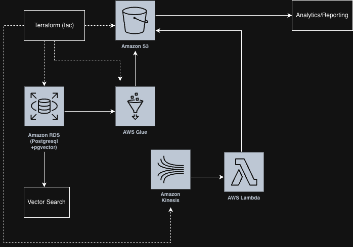

# Batch & Streaming Data Pipeline on AWS

## Problem Statement

Modern applications require timely insights from both historical (batch) data
and real-time (streaming) events to support operational and analytical use cases.

Relying on batch processing alone introduces latency, while streaming systems
without historical context limit deeper analysis.

The goal of this project is to design a **hybrid batch and streaming data
pipeline** that:
- Ingests real-time events and batch data from multiple sources
- Processes data using scalable, event-driven components
- Stores data in a centralized storage layer for downstream analytics
- Supports low-latency access while maintaining historical accuracy

## Architecture Diagram

## What I Learned

- Difference between batch processing and streaming processing
- How Amazon S3 is used as a data lake storage layer
- How AWS Glue can perform batch ETL transformations
- How Amazon Kinesis supports real-time ingestion
- How AWS Lambda can process streaming events
- How to structure a project repository like an AWS sample repo

## Challenges Faced

- Understanding when to use batch processing versus streaming processing
- Designing a clear architecture without overcomplicating AWS services
- Keeping the project beginner-friendly while still realistic
- Structuring the repository to clearly explain the data flow

## Deployment

This project focuses on architecture and learning rather than full cloud deployment.

- AWS services are represented using placeholders
- The design follows real-world AWS data engineering patterns
- The project is deployment-ready but avoids actual deployment to prevent unnecessary cloud costs

  
